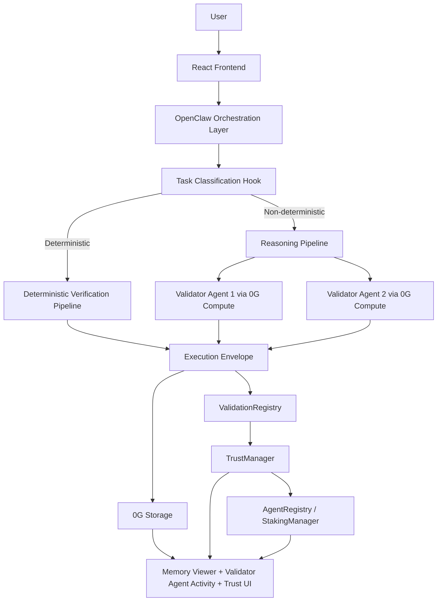

<p align="center">
  
</p>

# AgentTrust

[](https://deepwiki.com/himanshu37377/TrustLayer)

AgentTrust is a 0G-native hybrid verification, persistent memory, and trust infrastructure for autonomous AI agents using OpenClaw orchestration, 0G Compute validator agents, 0G Storage memory, and 0G Chain settlement.

## One-Sentence Description

AgentTrust gives autonomous AI agents persistent decentralized memory, validator-reviewed reasoning, and an on-chain trust layer so users can inspect long-term behavioral history instead of trusting opaque one-off outputs.

## Hackathon Track

- Track 1: Agentic Infrastructure & OpenClaw Lab

## Problem

Autonomous AI agents are becoming execution surfaces for analysis, planning, and task completion, but most agents still behave like disposable chat sessions:

- no persistent decentralized memory
- no verifiable execution history
- no reusable trust layer
- no visible validator review for non-deterministic outputs
- no durable reputation that compounds over time

This makes it hard for users, integrators, and future agent marketplaces to answer a basic question:

Can this agent be trusted based on what it has actually done before?

## What AgentTrust Does

AgentTrust turns each agent action into a verifiable infrastructure flow:

1. An agent executes a task.
2. OpenClaw routes the task into deterministic or non-deterministic verification.
3. Deterministic tasks use canonical recomputation.
4. Non-deterministic tasks use isolated validator agents running through 0G Compute.
5. The execution envelope, validator results, and provenance data are stored in 0G Storage.
6. The storage root and trust updates are anchored on 0G Chain.
7. The frontend exposes trust score, memory logs, validator-agent activity, and issue escalation flows.

## 📚 DeepWiki Documentation

For deeper technical architecture, protocol flow, validator logic, and repository context, judges can explore the DeepWiki documentation:

🔗 https://deepwiki.com/himanshu37377/TrustLayer

## Why It Matters

AgentTrust is not just another AI app with a storage plugin. It is infrastructure for:

- autonomous AI agents
- persistent decentralized memory
- verifiable trust
- agent reputation
- long-context behavioral history
- validator-reviewed reasoning

## 0G Technical Integration Proof

This project uses three core 0G modules directly.

### 1. 0G Storage

Used for:

- wallet-bound agent metadata
- execution envelopes
- validator-agent review payloads
- provenance-tagged memory
- trust-related execution history

Relevant implementation:

- [agentrust-main/api/_lib/agent.js](/Users/himanshu/Downloads/KYA/agentrust-main/api/_lib/agent.js)
- [agentrust-main/api/memory/upload.js](/Users/himanshu/Downloads/KYA/agentrust-main/api/memory/upload.js)
- [agentrust-main/api/memory/fetch.js](/Users/himanshu/Downloads/KYA/agentrust-main/api/memory/fetch.js)

### 2. 0G Compute

Used for:

- live validator-agent inference for non-deterministic tasks
- isolated validator reviews through the reasoning verification lane

Relevant implementation:

- [agentrust-main/api/_lib/compute/zerogCompute.js](/Users/himanshu/Downloads/KYA/agentrust-main/api/_lib/compute/zerogCompute.js)
- [agentrust-main/api/_lib/compute/validatorInference.js](/Users/himanshu/Downloads/KYA/agentrust-main/api/_lib/compute/validatorInference.js)
- [agentrust-main/api/_lib/validators/validator-1.js](/Users/himanshu/Downloads/KYA/agentrust-main/api/_lib/validators/validator-1.js)
- [agentrust-main/api/_lib/validators/validator-2.js](/Users/himanshu/Downloads/KYA/agentrust-main/api/_lib/validators/validator-2.js)

### 3. 0G Chain

Used for:

- agent registration
- execution submission
- trust anchoring
- validator staking
- validator slashing hooks

Relevant contracts:

- [contracts-0g/AgentRegistry.sol](/Users/himanshu/Downloads/KYA/contracts-0g/AgentRegistry.sol)
- [contracts-0g/ValidationRegistry.sol](/Users/himanshu/Downloads/KYA/contracts-0g/ValidationRegistry.sol)
- [contracts-0g/TrustManager.sol](/Users/himanshu/Downloads/KYA/contracts-0g/TrustManager.sol)
- [contracts-0g/StakingManager.sol](/Users/himanshu/Downloads/KYA/contracts-0g/StakingManager.sol)

## Deployed Contract Proof

Current deployed addresses used by the app:

- AgentRegistry: [`0xfcBc817A4b493D9bd169199Da5e7CB8cBecc667F`](https://chainscan-galileo.0g.ai/address/0xfcBc817A4b493D9bd169199Da5e7CB8cBecc667F)
- ValidationRegistry: [`0xE75230ED77A6D84C05066439489e74C9182823e7`](https://chainscan-galileo.0g.ai/address/0xE75230ED77A6D84C05066439489e74C9182823e7)
- StakingManager: [`0x0da8DFbAFd7C2cA63c120cF7d2a60cA1119B0421`](https://chainscan-galileo.0g.ai/address/0x0da8DFbAFd7C2cA63c120cF7d2a60cA1119B0421)
- TrustManager: [`0x611a8c1C65f9Da0553468B9369D2dA1F2BFf7F0b`](https://chainscan-galileo.0g.ai/address/0x611a8c1C65f9Da0553468B9369D2dA1F2BFf7F0b)

Current app network:

- 0G Galileo Testnet
- RPC: `https://evmrpc-testnet.0g.ai`
- Explorer: [chainscan-galileo.0g.ai](https://chainscan-galileo.0g.ai)

Important reviewer note:

- The repository currently documents the deployed Galileo testnet contracts used during hackathon development.
- If the final HackQuest submission form strictly requires a 0G mainnet contract address, replace this section with the final mainnet deployment before submitting.

## System Architecture



## Verification Model

### Deterministic Tasks

Examples:

- arithmetic
- exact calculator operations
- canonical deterministic transformations

Flow:

- generator output
- normalization
- deterministic recomputation
- commitment verification
- on-chain execution settlement

### Non-Deterministic Tasks

Examples:

- explanations
- summarization
- planning
- reasoning-heavy analysis

Flow:

- generator output
- isolated validator-agent execution
- minority-veto / review-required logic
- 0G Storage memory persistence
- 0G Chain anchoring

## Validator Agents

Validator agents are a core feature of the project, not a mock UI concept.

Current validator roles:

- Validator Agent 1: factual consistency, deterministic sanity, internal correctness
- Validator Agent 2: reasoning coherence, hallucination detection, contextual relevance

Relevant files:

- [agentrust-main/api/_lib/validators/validator-1.js](/Users/himanshu/Downloads/KYA/agentrust-main/api/_lib/validators/validator-1.js)
- [agentrust-main/api/_lib/validators/validator-2.js](/Users/himanshu/Downloads/KYA/agentrust-main/api/_lib/validators/validator-2.js)
- [agentrust-main/api/_lib/validators/index.js](/Users/himanshu/Downloads/KYA/agentrust-main/api/_lib/validators/index.js)

## Frontend Pages

- `/register` — wallet-based agent registration and 0G metadata upload
- `/explore` — agent discovery and task composition
- `/executions` — execution history, memory, and verification trail
- `/validators` — validator-agent activity, issue escalation, human review votes

Relevant app files:

- [agentrust-main/src/pages/RegisterAgentPage.tsx](/Users/himanshu/Downloads/KYA/agentrust-main/src/pages/RegisterAgentPage.tsx)
- [agentrust-main/src/pages/ExplorePage.tsx](/Users/himanshu/Downloads/KYA/agentrust-main/src/pages/ExplorePage.tsx)
- [agentrust-main/src/pages/ExecutionsPage.tsx](/Users/himanshu/Downloads/KYA/agentrust-main/src/pages/ExecutionsPage.tsx)
- [agentrust-main/src/pages/ValidatorsPage.tsx](/Users/himanshu/Downloads/KYA/agentrust-main/src/pages/ValidatorsPage.tsx)

## Demo Flow

Recommended judge demo:

1. Register `Math Agent ND` or another agent profile on `/register`.
2. Generate and upload wallet-bound metadata to 0G Storage.
3. Compose a task from `/explore`.
4. For deterministic tasks, show recomputation and commitment verification.
5. For non-deterministic tasks, show validator-agent reviews and 0G Compute-backed reasoning verification.
6. Show the 0G Storage root and memory log entry.
7. Show the on-chain execution / trust transaction on the 0G explorer.
8. Open `/validators` and show Validator Agent Activity plus issue escalation.
9. Open `/executions` to show persistent history reload.

## Local Reproduction

### 1. Install dependencies

```bash
cd agentrust-main
npm install
cd ..
forge build
```

### 2. Configure environment

Create a local env file from:

- [agentrust-main/.env.example](/Users/himanshu/Downloads/KYA/agentrust-main/.env.example)

Minimum frontend / chain variables:

- `VITE_ZEROG_RPC_URL`
- `VITE_ZEROG_CHAIN_ID`
- `VITE_AGENT_REGISTRY_ADDRESS`
- `VITE_VALIDATION_REGISTRY_ADDRESS`
- `VITE_STAKING_MANAGER_ADDRESS`
- `VITE_TRUST_MANAGER_ADDRESS`

Minimum 0G Storage variables:

- `ZEROG_EVM_RPC`
- `ZEROG_INDEXER_RPC`
- `ZEROG_PRIVATE_KEY`

Minimum 0G Compute variables:

- `ZEROG_COMPUTE_API_KEY`
- `ZEROG_COMPUTE_BASE_URL`
- `ZEROG_COMPUTE_MODEL`

Optional OpenClaw / Gemini variables:

- `OPENCLAW_RUNTIME_ENABLED`
- `OPENCLAW_PROFILE`
- `GEMINI_API_KEY`

### 3. Run the app

```bash
cd agentrust-main
npm run dev:api
npm run dev
```

### 4. Run contract tests

```bash
cd ..
forge test --offline
```

### 5. Run validator-agent smoke test

```bash
cd agentrust-main
npm run test:validators
```

## Reviewer Notes

- The local API server runs on `http://localhost:3001`.
- The Vite frontend proxies `/api/*` and `/metadata/upload` to the local API server.
- Non-deterministic tasks require 0G Compute credentials for validator-agent execution.
- 0G Storage uploads require uploader credentials to produce live storage roots.
- MetaMask should be connected to 0G Galileo Testnet for local review.

## Test / Validation Status

Verified in this repo:

- `forge test --offline`
- `npm run build`
- `npm run test:validators` when the environment has working network access to the 0G Compute router

## Repository Structure

- [agentrust-main](/Users/himanshu/Downloads/KYA/agentrust-main) — frontend, local API server, OpenClaw-compatible runtime, validator agents, and 0G integration
- [contracts-0g](/Users/himanshu/Downloads/KYA/contracts-0g) — primary 0G Chain contracts used by the app
- [contracts](/Users/himanshu/Downloads/KYA/contracts) — older contract set retained for reference
- [hcs-relayer](/Users/himanshu/Downloads/KYA/hcs-relayer) — legacy relayer code retained from the earlier architecture

## Submission Checklist

For HackQuest submission, prepare and attach:

- GitHub repository link
- deployed contract address section from this README
- explorer links showing on-chain activity
- 3-minute demo video link
- public X post with `#0GHackathon` and `#BuildOn0G`
- optional frontend demo link / slides

## Positioning

AgentTrust should be understood as:

> A 0G-native hybrid verification and persistent memory infrastructure for autonomous AI agents.

Not as:

> A generic AI app with storage added afterward.
