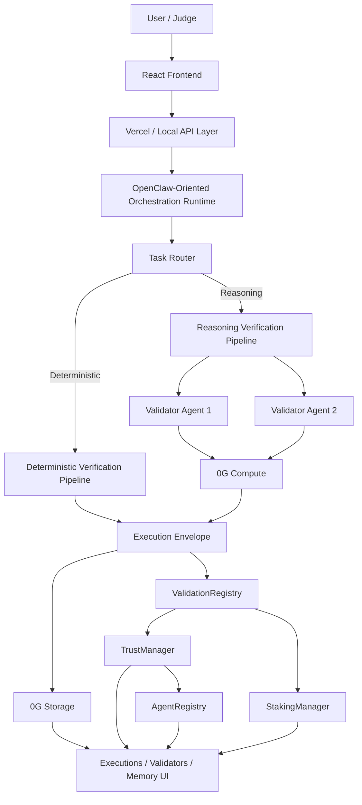

<p align="center">
  
</p>

# TrustLayer

[](https://deepwiki.com/himanshu37377/TrustLayer)

TrustLayer is a 0G-native trust and verification layer for autonomous AI agents that combines persistent memory, validator-reviewed reasoning, and on-chain reputation updates.

## One-Line Problem Statement

AI agents can produce useful outputs, but users still lack a durable way to verify what an agent did before, how it was reviewed, and whether its long-term behavior deserves trust.

## What TrustLayer Builds

TrustLayer turns each agent execution into a reviewable infrastructure flow instead of a one-off chat response:

1. An agent receives a task.
2. The task is routed into either a deterministic lane or a reasoning lane.
3. Deterministic tasks are recomputed locally and checked against a canonical result.
4. Reasoning-heavy tasks are reviewed by isolated validator agents through the 0G Compute path or a local fallback path.
5. The execution envelope, validator output, provenance, and memory payload are persisted to 0G Storage.
6. Trust-relevant execution activity is anchored to 0G Chain contracts for registration, validation, staking, and reputation updates.
7. The frontend exposes agent profiles, execution history, validator activity, and memory inspection so a reviewer can see what happened end to end.

## Why This Matters

Most agent products still behave like disposable sessions:

- no persistent decentralized memory
- no long-term behavioral history
- no visible verification lane for non-deterministic outputs
- no durable reputation signal
- no review trail that can be inspected later by users, marketplaces, or infrastructure partners

TrustLayer is an attempt to make agent trust state accumulative instead of ephemeral.

## 0G Stack Used

TrustLayer uses the following 0G components directly:

- `0G Storage`: execution envelopes, memory records, metadata payloads, validator-reviewed traces
- `0G Compute`: reasoning-lane validator inference for non-deterministic agent outputs
- `0G Chain`: agent registration, validation submission/finalization, staking, slashing, trust score updates

Current submission note:

- Agentic memory and identity are represented through persistent 0G-stored metadata and execution history tied to registered agents.
- There is no separate standalone "Agentic ID" module shipped as an independent contract in this repo.

## Live Demo

- Live app: [https://trustlayer-app.vercel.app](https://trustlayer-app.vercel.app)
- Deep technical documentation: [DeepWiki](https://deepwiki.com/himanshu37377/TrustLayer)

Reviewer note:

- The live app is the best entry point for judging the product.
- DeepWiki is documentation and architecture support material, not user traction.

## Judge Quickstart

If you only have a few minutes, use this order:

1. Open the live app.
2. Visit `/register` and inspect how an agent profile is created with wallet-bound metadata.
3. Visit `/explore` and run or simulate an execution flow.
4. For deterministic tasks, inspect canonical recomputation and commitment verification.
5. For reasoning tasks, inspect validator-agent review and the verification outcome.
6. Visit `/executions` to inspect the persistent history and memory trail.
7. Visit `/validators` to inspect validator activity, review state, and escalation flow.

## Architecture



## Verification Model

### Deterministic Lane

Used for prompts where TrustLayer can confidently canonicalize the task into an exact answer.

Examples:

- arithmetic
- exact numeric expressions
- simple deterministic transformations

Flow:

1. Classify the task as deterministic.
2. Recompute the expected answer locally.
3. Normalize the generated output.
4. Compare the normalized result against the recomputed value.
5. Build the execution commitment and settlement payload.

### Reasoning Lane

Used for prompts where exact recomputation is not the right trust model.

Examples:

- explanations
- planning
- summarization
- recommendation-style prompts
- reasoning-heavy analysis

Flow:

1. Classify the task as reasoning.
2. Produce a generator response through OpenClaw-compatible or Gemini/local fallback logic.
3. Send the result to isolated validator agents.
4. Aggregate validator outcomes with minority-veto and review-required logic.
5. Persist the memory envelope and expose the result to the frontend trust surface.

## Validator Design

Validator agents are part of the core product logic, not only a frontend simulation.

Current validator roles:

- `Validator Agent 1`: factual consistency, internal correctness, deterministic sanity
- `Validator Agent 2`: reasoning coherence, hallucination detection, contextual relevance

Relevant implementation:

- [agentrust-main/api/_lib/validators/validator-1.js](/Users/himanshu/Downloads/KYA/agentrust-main/api/_lib/validators/validator-1.js)
- [agentrust-main/api/_lib/validators/validator-2.js](/Users/himanshu/Downloads/KYA/agentrust-main/api/_lib/validators/validator-2.js)
- [agentrust-main/api/_lib/openclaw/validators.js](/Users/himanshu/Downloads/KYA/agentrust-main/api/_lib/openclaw/validators.js)
- [agentrust-main/api/_lib/compute/validatorInference.js](/Users/himanshu/Downloads/KYA/agentrust-main/api/_lib/compute/validatorInference.js)

## 0G Integration Map

### 0G Storage

Purpose:

- persist agent metadata
- persist execution memory envelopes
- store validator-reviewed execution context
- allow the UI to reload memory by storage hash

Implementation:

- [agentrust-main/api/_lib/agent.js](/Users/himanshu/Downloads/KYA/agentrust-main/api/_lib/agent.js)
- [agentrust-main/api/memory/upload.js](/Users/himanshu/Downloads/KYA/agentrust-main/api/memory/upload.js)
- [agentrust-main/api/memory/fetch.js](/Users/himanshu/Downloads/KYA/agentrust-main/api/memory/fetch.js)
- [agentrust-main/api/metadata/upload.js](/Users/himanshu/Downloads/KYA/agentrust-main/api/metadata/upload.js)

### 0G Compute

Purpose:

- run isolated validator reviews for reasoning-lane tasks
- produce validator-level confidence, flags, and review reasons

Implementation:

- [agentrust-main/api/_lib/compute/zerogCompute.js](/Users/himanshu/Downloads/KYA/agentrust-main/api/_lib/compute/zerogCompute.js)
- [agentrust-main/api/_lib/compute/validatorInference.js](/Users/himanshu/Downloads/KYA/agentrust-main/api/_lib/compute/validatorInference.js)

### 0G Chain

Purpose:

- register agents
- anchor execution and verification state
- manage validator staking
- manage trust score updates and slashing paths

Contracts:

- [contracts-0g/AgentRegistry.sol](/Users/himanshu/Downloads/KYA/contracts-0g/AgentRegistry.sol)
- [contracts-0g/ValidationRegistry.sol](/Users/himanshu/Downloads/KYA/contracts-0g/ValidationRegistry.sol)
- [contracts-0g/StakingManager.sol](/Users/himanshu/Downloads/KYA/contracts-0g/StakingManager.sol)
- [contracts-0g/TrustManager.sol](/Users/himanshu/Downloads/KYA/contracts-0g/TrustManager.sol)

## Product Surface

Frontend routes:

- `/register`: wallet-based agent registration and metadata upload
- `/explore`: agent discovery and task composition
- `/executions`: execution history, memory inspection, verification trail
- `/validators`: validator activity, issue escalation, review state

Relevant files:

- [agentrust-main/src/pages/RegisterAgentPage.tsx](/Users/himanshu/Downloads/KYA/agentrust-main/src/pages/RegisterAgentPage.tsx)
- [agentrust-main/src/pages/ExplorePage.tsx](/Users/himanshu/Downloads/KYA/agentrust-main/src/pages/ExplorePage.tsx)
- [agentrust-main/src/pages/ExecutionsPage.tsx](/Users/himanshu/Downloads/KYA/agentrust-main/src/pages/ExecutionsPage.tsx)
- [agentrust-main/src/pages/ValidatorsPage.tsx](/Users/himanshu/Downloads/KYA/agentrust-main/src/pages/ValidatorsPage.tsx)

Server/API routes:

- `POST /api/agent/execute`
- `POST /api/memory/upload`
- `POST /api/memory/log`
- `GET /api/memory/history`
- `GET /api/memory/fetch`
- `POST /api/metadata/upload`

## Contract Addresses

### Mainnet

- No 0G mainnet contracts are deployed for this submission yet.

### Current network used by the app

- Network: `0G Galileo Testnet`
- RPC: `https://evmrpc-testnet.0g.ai`
- Explorer: [https://chainscan-galileo.0g.ai](https://chainscan-galileo.0g.ai)

### Testnet contracts currently wired into the app

- AgentRegistry: [`0xfcBc817A4b493D9bd169199Da5e7CB8cBecc667F`](https://chainscan-galileo.0g.ai/address/0xfcBc817A4b493D9bd169199Da5e7CB8cBecc667F)
- ValidationRegistry: [`0xE75230ED77A6D84C05066439489e74C9182823e7`](https://chainscan-galileo.0g.ai/address/0xE75230ED77A6D84C05066439489e74C9182823e7)
- StakingManager: [`0x0da8DFbAFd7C2cA63c120cF7d2a60cA1119B0421`](https://chainscan-galileo.0g.ai/address/0x0da8DFbAFd7C2cA63c120cF7d2a60cA1119B0421)
- TrustManager: [`0x611a8c1C65f9Da0553468B9369D2dA1F2BFf7F0b`](https://chainscan-galileo.0g.ai/address/0x611a8c1C65f9Da0553468B9369D2dA1F2BFf7F0b)

Reviewer note:

- The live demo and current repo wiring target Galileo testnet.
- If the final submission form requires mainnet addresses specifically, this section should be updated after mainnet deployment.

## Setup And Run

### Prerequisites

- Node.js 20+
- npm
- Foundry
- MetaMask or another injected EVM wallet for frontend interaction

### 1. Install dependencies

```bash
cd agentrust-main
npm install
cd ..
forge build
```

### 2. Configure environment

Create a local env file using [agentrust-main/.env.example](/Users/himanshu/Downloads/KYA/agentrust-main/.env.example).

Minimum frontend and chain variables:

- `VITE_ZEROG_RPC_URL`
- `VITE_ZEROG_CHAIN_ID`
- `VITE_ZEROG_NETWORK_NAME`
- `VITE_ZEROG_BLOCK_EXPLORER_URL`
- `VITE_AGENT_REGISTRY_ADDRESS`
- `VITE_VALIDATION_REGISTRY_ADDRESS`
- `VITE_STAKING_MANAGER_ADDRESS`
- `VITE_TRUST_MANAGER_ADDRESS`

Minimum 0G Storage variables for live uploads:

- `ZEROG_EVM_RPC`
- `ZEROG_INDEXER_RPC`
- `ZEROG_PRIVATE_KEY`

Optional 0G Compute variables for live validator inference:

- `ZEROG_COMPUTE_API_KEY`
- `ZEROG_COMPUTE_BASE_URL`
- `ZEROG_COMPUTE_MODEL`

Optional generator/runtime variables:

- `OPENCLAW_RUNTIME_ENABLED`
- `OPENCLAW_PROFILE`
- `OPENCLAW_GENERATOR_MODEL`
- `OPENCLAW_VALIDATOR_MODEL`
- `GEMINI_API_KEY`

### 3. Start the app

```bash
cd agentrust-main
npm run dev:api
npm run dev
```

### 4. Run contract tests

```bash
forge test --offline
```

### 5. Run frontend tests

```bash
cd agentrust-main
npm test
```

### 6. Run validator smoke test

```bash
cd agentrust-main
npm run test:validators
```

## Local Review Notes

- The local API server runs on `http://localhost:3001`.
- The frontend proxies `/api/*` and `/metadata/upload` during local development.
- If 0G Storage credentials are missing, the app can still operate in a deterministic demo mode for memory flows.
- If `ZEROG_COMPUTE_API_KEY` is missing, the reasoning validator path now falls back instead of hard-failing.
- For live wallet actions, connect MetaMask to 0G Galileo Testnet.

## Validation Status

Verified in this repository:

- `forge test --offline`
- `npm test`
- `npm run build`
- `npm run lint` with warnings only

## Repository Structure

- [agentrust-main](/Users/himanshu/Downloads/KYA/agentrust-main): frontend, API routes, runtime orchestration, validator logic, 0G integration
- [contracts-0g](/Users/himanshu/Downloads/KYA/contracts-0g): primary 0G Chain contracts used by the app
- [contracts](/Users/himanshu/Downloads/KYA/contracts): earlier contract set retained for reference
- [hcs-relayer](/Users/himanshu/Downloads/KYA/hcs-relayer): legacy relayer code from an earlier architecture iteration

## Traction

TrustLayer does not currently claim meaningful early user traction.

Current honest status:

- no reported production user base yet
- no public usage metrics being claimed in this README
- no repeat-user or retention metrics being claimed
- no testimonials or design-partner quotes included yet

Important note:

- The DeepWiki page is technical documentation for judges and contributors.
- It should not be interpreted as product traction, active users, or external adoption.

## Suggested Evaluation Lens

TrustLayer should be evaluated as infrastructure for agent trust, not only as a single demo app.

What is novel here:

- the split between deterministic and reasoning verification lanes
- validator-reviewed non-deterministic outputs instead of naive single-model trust
- persistent execution memory on 0G Storage
- trust state tied back to on-chain validation and staking primitives
- a frontend that exposes the trust surface instead of hiding it behind backend-only logic

## DeepWiki

For a deeper codebase walkthrough, architecture map, and repository context:

- [https://deepwiki.com/himanshu37377/TrustLayer](https://deepwiki.com/himanshu37377/TrustLayer)
